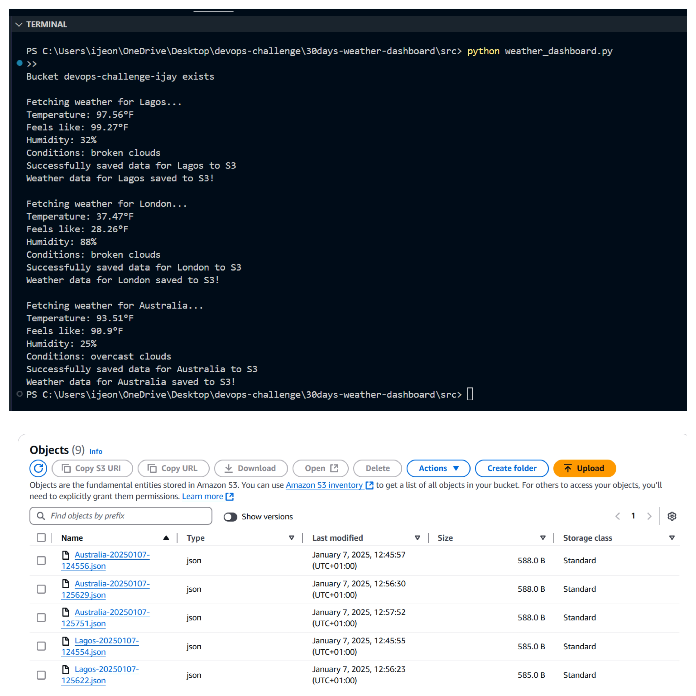

    

# Weather Fetching

  
Table of Contents 

  <ol>
    <li><a href="#about-the-project">About The Project</a>
        <ul>
            <li><a href="#overview">Overview</a></li>
            <li><a href="#key-features">Key Features</a></li>
        </ul>
    </li>
     <li><a href="#technoloy">Technologies Used</a></li>
    <li><a href="#depedencies">Dependencies</a></li>
    <li><a href="#overview">Code Overview</a></li>
    <li><a href="#challenges">Challenges</a></li>
  </ol>

 
## About The Project
The project is a simple application that fetches real-time weather data for different cities and saves it in an Amazon S3 bucket. It uses the OpenWeather API to get the weather information and AWS S3 to store the data in JSON format for easy access and tracking.

### Key Features

- Open weather API key

- AWS account

- AWS S3

### Technologies Used

- Python

- AWS S3

- Open weather API

#### Dependencies

- boto3

- requests

- datetime

- dotenv

### Overview

* [Repo Codes](https://github.com/ijayhub/devops-ijay-cozy-cloud)

* [documentation](https://dev.to/ijay/30days-devops-challenge-5b3f)

* [Blog post]()

(<a href="#top">back to top</a>)

### Challenges

Every project has its challenges. For this one, setting up my development environment was a bit tricky, as I had to make sure all the tools and settings were correct. Also, getting my code to fetch data from the API was challenging at first, especially handling errors and making sure the data was retrieved properly.

(<a href="#top">back to top</a>)

